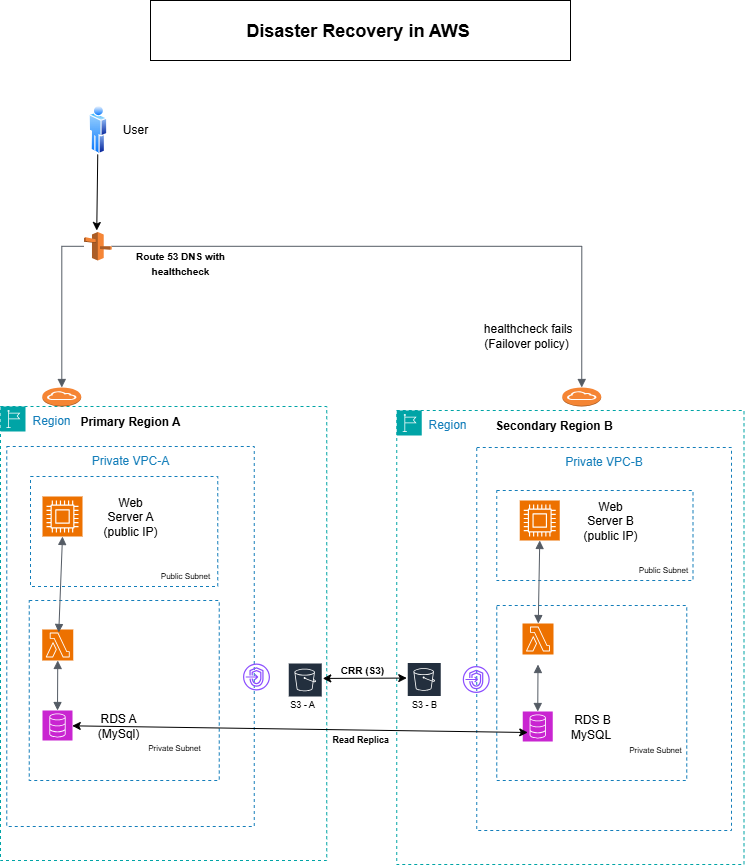

# 🌩️ AWS Disaster Recovery Across Regions (POC)

This project implements a disaster recovery strategy using AWS services across multiple regions with Route 53 failover, Lambda, S3 CRR, RDS (MySQL), Flask, and VPC Endpoints.

---

## 💡 Architecture



<sub>_This image must be in the same folder as this file (e.g., uploaded to the root of your repo)._</sub>

---

## 🧪 Lambda Function (Python)

```python
import boto3
import pymysql

def lambda_handler(event, context):
    s3 = boto3.client('s3')
    rds = pymysql.connect(...)  # connection details
    # fetch data from RDS and return
```

---

## 🌐 Flask App on EC2

```python
from flask import Flask
import boto3

app = Flask(__name__)
lambda_client = boto3.client('lambda')

@app.route('/')
def index():
    response = lambda_client.invoke(
        FunctionName='ReadS3RDSData',
        InvocationType='RequestResponse'
    )
    return response['Payload'].read().decode('utf-8')

if __name__ == '__main__':
    app.run(host='0.0.0.0', port=80)
```

---

## 📂 Folder Structure

```
AWS-DR-AcrossRegion/
├── index.md
├── architecture.png
├── lambda/
│   └── lambda_function.py
├── ec2/
│   └── app.py
├── scripts/
│   └── setup.sh
```

---

## 🔗 Useful Links

- [GitHub Repo](https://github.com/yourusername/AWS-DR-AcrossRegion)
- [Live Project Page](https://yourusername.github.io/AWS-DR-AcrossRegion/)

---

## 📌 Notes

- Upload your `architecture.png` image to the root of the repo.
- Make sure your `.py` files are also added in `lambda/` and `ec2/` folders.
